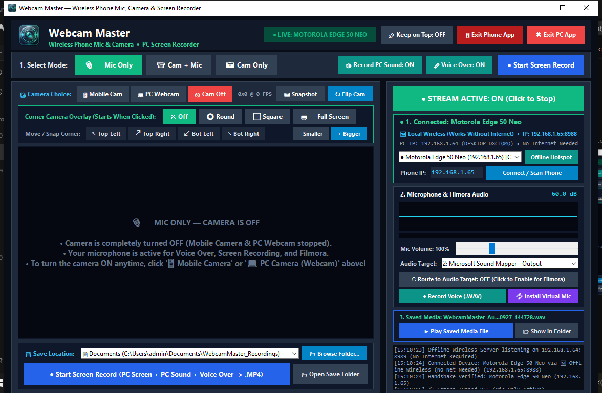

# 🎥🎙️ Webcam Master — Wireless Phone Mic, HD Camera & PC Screen Recorder

**Webcam Master** turns any Android smartphone into a **low-latency wireless microphone and HD webcam** for Windows PC — complete with a built-in **PC Screen Recorder (`.MP4`)**, **PC System Sound + Voice-Over mixer**, **Filmora-style movable Round / Square corner camera overlay**, and **1-click Mobile Camera vs. PC Webcam switching**.

Works **100% offline without Internet** over Phone Hotspot, PC Mobile Hotspot, Local Wi-Fi, or USB.



---

## ✨ Key Features

### 1. 🎛️ 3 Operating Modes (Two-Way Synced Between PC & Phone)
- **`🎙️ Mic Only`**: Completely turns **OFF** all cameras (both Mobile Camera and PC Webcam stop immediately) and uses your phone purely as a wireless microphone for Filmora, screen recording, voice-overs, or any Windows app.
- **`📹 Cam + Mic`**: Streams live HD video (from either your Mobile Camera or PC Webcam) together with live microphone audio.
- **`📷 Cam Only`**: Streams live video only while muting microphone audio.

### 2. 🎥 1-Click Camera Choice (`📱 Mobile Cam` | `💻 PC Webcam` | `🚫 Cam Off`)
- **`📱 Mobile Cam`**: Uses your Android phone's front or back HD camera wirelessly or via USB.
  - **`↻ Flip Cam`**: Instant 1-click button on both PC and phone to switch between your phone's **Front** and **Back** camera.
- **`💻 PC Webcam`**: Uses your PC's built-in or USB webcam via fast DirectShow capture — works **even when no mobile phone is connected**, or while your phone is connected as a wireless microphone.
- **`🚫 Cam Off`**: Instantly stops both cameras, releases camera hardware, closes any floating overlay, and clears the preview screen.
- **`📷 Snapshot`**: Saves an instant high-resolution `.JPG` photo from the active camera.

### 3. ⭕ Filmora-Style Movable Corner Camera Overlay
- **Starts Only When Clicked (`✖ Off` by default)**: Never pops up automatically on startup.
- **3 Overlay Shapes**:
  - **`⭕ Round`**: Circular floating facecam in the corner of your screen.
  - **`⬜ Square`**: Rounded-square floating facecam in the corner.
  - **`🖥️ Full Screen`**: Full-screen camera display.
- **Freely Movable & Resizable**:
  - Drag anywhere on your screen with the mouse, or use 1-click corner snap buttons (**`↖ Top-Left`**, **`↗ Top-Right`**, **`↙ Bot-Left`**, **`↘ Bot-Right`**).
  - Resize smoothly with **`- Smaller`**, **`+ Bigger`**, or the **mouse scroll wheel**.
  - **Right-Click Context Menu** on the floating camera to switch camera source, change shape, snap corners, or turn it off.

### 4. 🖥️ PC Screen Recorder with System Sound + Voice Over (`.MP4`)
- **Full PC Screen Recording**: Captures your live PC screen (including the movable `⭕ Round` or `⬜ Square` corner camera if enabled) and exports directly to `.MP4`.
- **`🔊 Record PC Sound: ON / OFF`**: Captures your PC's internal system audio (`Stereo Mix` loopback) so computer and application sound is recorded.
- **`🎤 Voice Over: ON / OFF`**: Records your live voice-over narration from your connected phone mic (or PC mic fallback if no phone is connected) mixed cleanly with PC system sound.
- **Invisible Floating `■ Stop Rec` Pill & Blinking Dot**:
  - Appears **only** while screen recording is active so you can stop recording anytime.
  - Uses Windows `WDA_EXCLUDEFROMCAPTURE` display affinity so the **Stop Recording button is never recorded inside your final `.MP4` video**.

### 5. 📡 100% Offline Wireless & USB Connectivity (No Internet Required)
- Connects over local TCP/UDP (`8988` / `8989` / `8990`) with **zero internet dependency**:
  1. **Phone Wi-Fi Hotspot** (Connect PC directly to your phone's Hotspot even with Mobile Data OFF).
  2. **PC Mobile Hotspot** (Connect phone directly to Windows Mobile Hotspot).
  3. **Local Wi-Fi Router** (Works even if the internet cable is unplugged).
  4. **USB Cable** (Automatic ADB TCP bridge when plugged in).
- **Live Connected Device Badge & Selector**: Displays the exact connected device model (e.g., `● LIVE: MOTOROLA EDGE 50 NEO`), connection mode, and IP address on both PC and phone.

### 6. 🎙️ Wireless Microphone & Virtual Camera for Wondershare Filmora / OBS / Zoom
- **Virtual Microphone Routing (`VB-Cable`)**: Routes your phone's 48 kHz PCM microphone stream to `CABLE Input` (`CABLE Output` in Filmora / OBS / Audacity) or any Windows audio target.
- **Virtual Webcam (`Webcam Master (Phone)`)**: Registers a DirectShow virtual camera (`UnityCapture`) so Filmora and other tools can select `Webcam Master (Phone)` directly as a camera input.
- **Standalone Voice Recorder (`● Record Voice (.WAV)`)**: Record standalone 48 kHz `.WAV` voice-over audio files with real-time waveform, dB meter, and volume boost (`20%`–`300%`).
- **Background & Screen-Off Operation on Phone**: Runs an Android foreground microphone service + wake lock with a live blinking indicator dot so the mic keeps streaming even when your phone screen is locked.

### 7. 💾 Flexible Save Location & Built-in Media Launcher
- Choose where `.MP4` and `.WAV` recordings are saved:
  - `Documents (C:\Users\<User>\Documents\WebcamMaster_Recordings)`
  - `C:\ Drive (C:\WebcamMaster_Recordings)`
  - `Videos Folder` or `Desktop Folder`
  - **`📂 Browse Folder...`** (Any custom directory)
  - **`❓ Ask Where to Save Every Time`** (`Save As...` dialog on each recording)
- **Saved Media Card**:
  - **`▶ Play Saved Media File`**: Plays your latest recorded `.MP4` or `.WAV` file in one click.
  - **`📂 Show in Folder`** / **`📂 Open Save Folder`**: Opens Windows Explorer directly to your recording.

---

## 📂 Repository Structure

```text
webcam-master/
├── WebcamMaster.exe                 # Windows Desktop Executable
├── WebcamMaster.apk                 # Android Mobile Application (Install on Phone)
├── Start_WebcamMaster.bat           # 1-Click Windows Launcher
├── requirements.txt                 # Python Dependencies
├── pc_app/
│   ├── motomic_pc.py                # Full Windows Desktop Studio Application & Engine
│   ├── webcam_master.ico            # Application Icon
│   └── WebcamMaster.spec            # PyInstaller Build Spec
├── MotoMicNative/
│   ├── AndroidManifest.xml          # Android App Manifest (Foreground Mic & Camera Service)
│   ├── build_apk.ps1                # Zero-Gradle Native Android SDK APK Builder
│   ├── res/                         # Android Icons & Drawables
│   └── src/com/example/motomic/
│       ├── MainActivity.java        # Android UI, Offline Wireless Server, Camera & Audio Streamer
│       └── MotoMicService.java      # Persistent Foreground Service for Background/Screen-Off Streaming
├── drivers/
│   └── install_virtual_devices.bat  # 1-Click Installer for Virtual Mic (VB-Cable) & Virtual Cam (UnityCapture)
└── assets/                          # App Icons & UI Screenshots
```

---

## 🚀 Quick Start Guide

### 1. Install on Android Phone
1. Copy **`WebcamMaster.apk`** to your Android phone and install it (or install via ADB: `adb install -r WebcamMaster.apk`).
2. Open **Webcam Master** on your phone and grant **Microphone** and **Camera** permissions.

### 2. Run on Windows PC
- **Option A (Direct Executable / Launcher)**:
  Double-click **`Start_WebcamMaster.bat`** (or **`WebcamMaster.exe`**).
- **Option B (Run from Python Source)**:
  ```bash
  pip install -r requirements.txt
  python pc_app/motomic_pc.py
  ```

### 3. Build Executables from Source (Optional)
- **Rebuild Windows `.exe`**:
  ```powershell
  python -m PyInstaller --noconfirm pc_app/WebcamMaster.spec
  ```
- **Rebuild Android `.apk`**:
  ```powershell
  powershell -ExecutionPolicy Bypass -File MotoMicNative/build_apk.ps1
  ```

---

## 👤 Author

**Bijay Mandal** ([@bijay356](https://github.com/bijay356))
